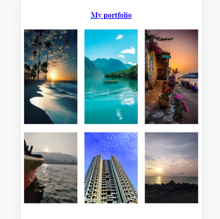
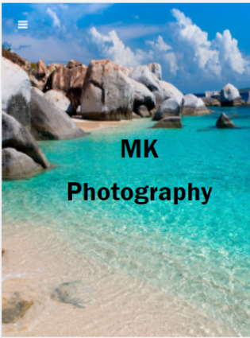

# PHOTOGRAPHY PORTFOLIO 

It is a front-end for a simple portfolio website for a photographer. The site is developed using HTML/CSS used. There is only one webpage which is divided in 4 sections.

- About
- My work
- Services
- About me

# Highlights

- Easy setup and you get a site of your own for free.
- To add new pictures, you need to just upload them. No code changes required.
## 🚀 About Me
I'm a Aspiring full stack developer...

## 🔗 Links

# Hi, I'm Mukesh! 👋

## Screenshots

